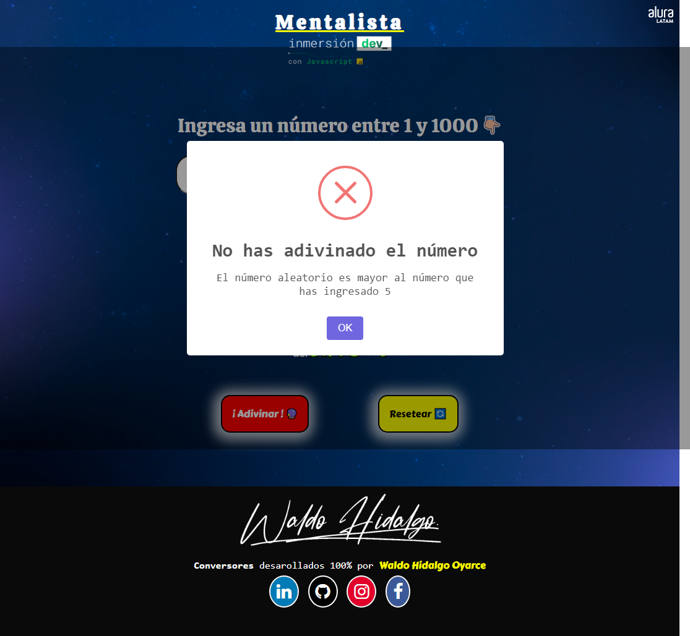
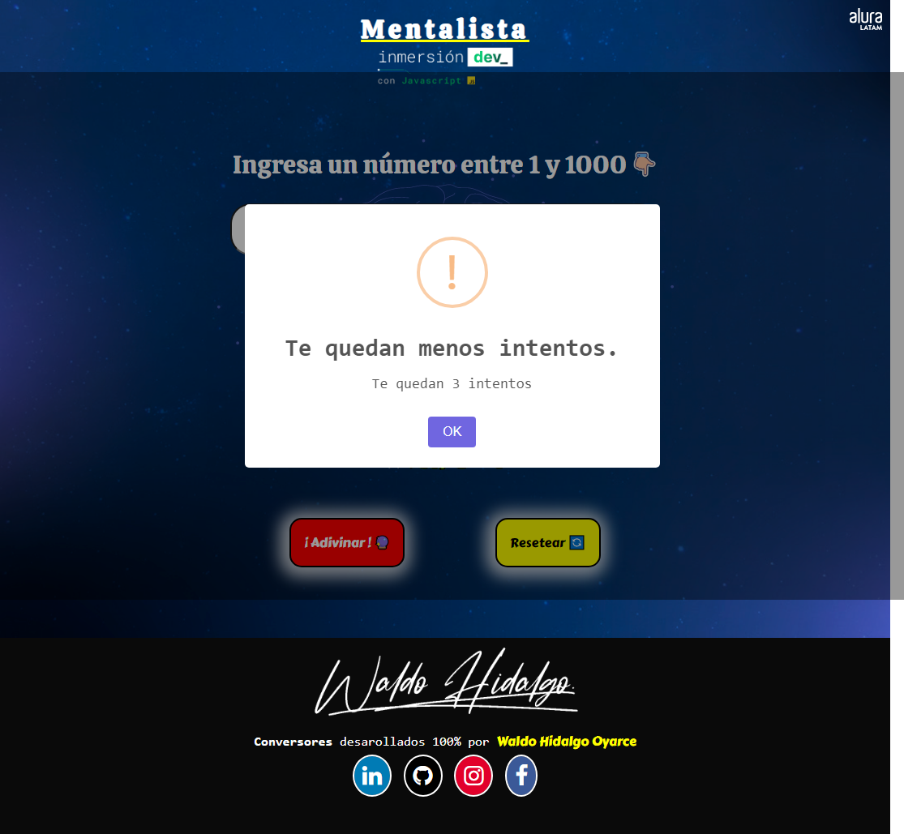
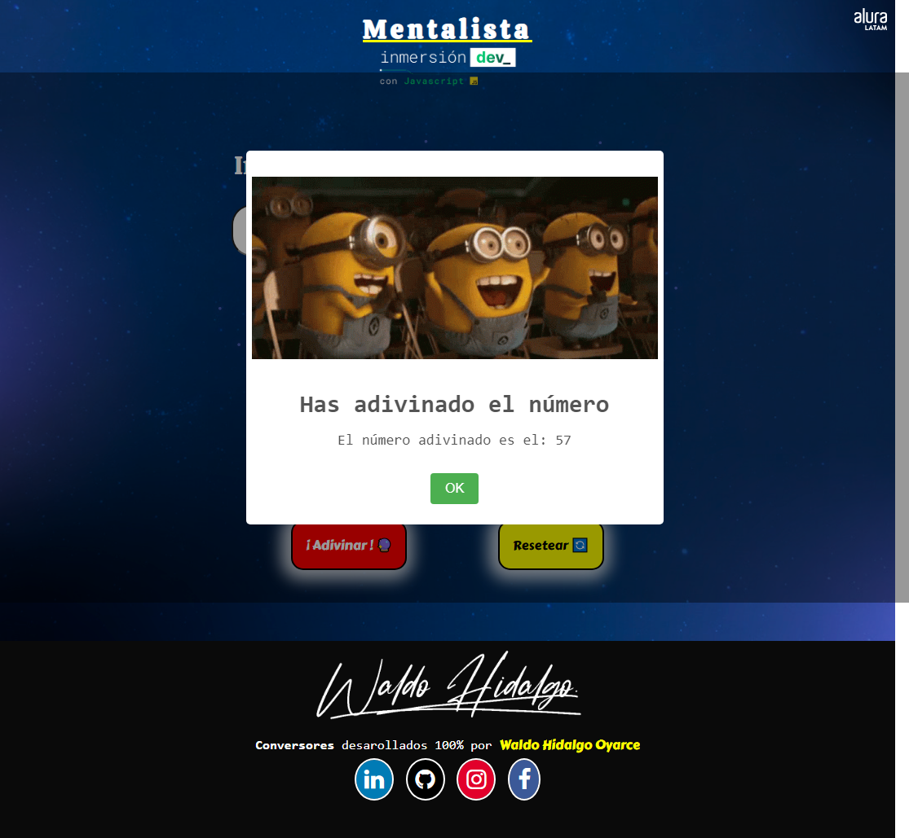

En la clase 2 de la semana de InmersiónDEV con JavaScript de AluraLatam se dejaron **cuatro** desafíos con respecto al proyecto que se realiza en la clase. El proyecto del curso consiste en la realización de un juego de adivinanza de un número el cual se genera de manera aleatoria utilizando HTML, CSS y JavaScript. El usuario debe ingresar números de modo tal de adivinar el número aleatorio generado. Los desafíos dejados en la clase fueron:

1-Agregar un número de intentos para que la persona intente acertar e imprimir la respuesta al final;

2-Cuando la persona se equivoque, incluir el número que fue digitado en el mensaje de error e informar en el mensaje si el número digitado es mayor o menor que el número secreto;

3-Descubrir el número máximo que una persona lleva para adivinar un número correcto;

4-Investigar y aprender la diferencia entre == y ===.

Mi juego de adivinanza cumple con **TODOS** los desafíos ( el cuarto desafío corresponde a que el operador == se utiliza para verificar igualdad de valor y el operador === se utiliza para verificar igualdad de valor y de tipo). El juego posee 5 intentos y muestro la respuesta en pantalla ya sea en la página misma y mediante una alerta. El rango de valores va desde 1 a 1000 y solo se consideran números enteros. Cuando la persona se equivoca muestro si el número aleatorio es mayor o menor que el número ingresado y a continuación muestro el número de intentos en otra alerta. Por último, para cada adivinación muestro el **porcentaje de números hasta el cierto sobre el total**, es decir, al principio cuando no existe data ingresada en el input (campo vacío) el porcentaje de intentos a realizar es del 100% lo que significa que se tienen todos los números a disposición. Cuando la persona ingresa algún número, la cantidad de números para probar hasta adivinar disminuye quedando en el rango de ese número y el número a adivinar como cota, es decir, si el número aleatorio a adivinar es 568 e ingreso el número 450, el rango es el valor absoluto de la resta entre 568 y 450. Por lo tanto, el porcentaje de números hasta la adivinanza vendría a ser el rango, anteriormente, obtenido sobre el total de valores posibles que es 1000.

Un screenshot de mi juego de adivinanza es el siguiente:

Mi proyecto también es 100% responsivo. El campo de ingreso de números solo permite el ingreso de números enteros de 1 a 1000. Si se quiere ingresar un número negativo, el campo se reestablece a blanco. Si se ingresa un número decimal entre 1 a 1000, este se redondea y si se quiere ingresar un número mayor a 1000, el campo se establece en 1000.

A continuación muestro una alerta que se genera cuando se hace click en el botón Adivinar estando el input de ingreso de números vacío:

Cuando ingreso un número mayor o menor al número aleatorio que se debe adivinar se generan las alertas respectivas siguientes:

A continuación de ambas alertas muestro otra con el número de intentos restantes:

Cuando se cumplen los 5 intentos se bloquea el input de ingreso de números y se inhabilita el botón de Adivinar. Para volver a resetear el número de intentos se debe hacer click en el botón Resetear el cual reinicia el número de intentos a 5 y habilita el input y el botón Adivinar.

Cuando el usuario acierta, se muestra una alerta de éxito:

Por último, muestro la pantalla completa en la cual se puede verificar que el número de intentos y el **porcentaje de números hasta el cierto sobre el total** se actualizan de manera dinámica:

Spoiler: para probar el juego y todas sus funcionalidades, el número a adivinar lo imprimo en la consola de desarrollador.
